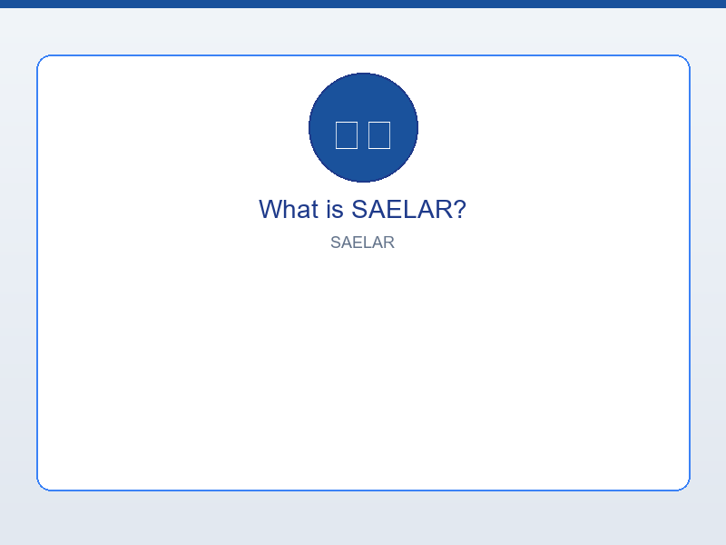
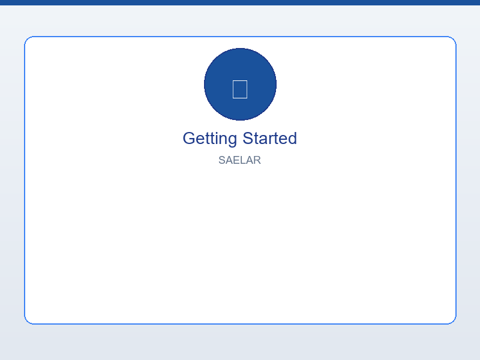
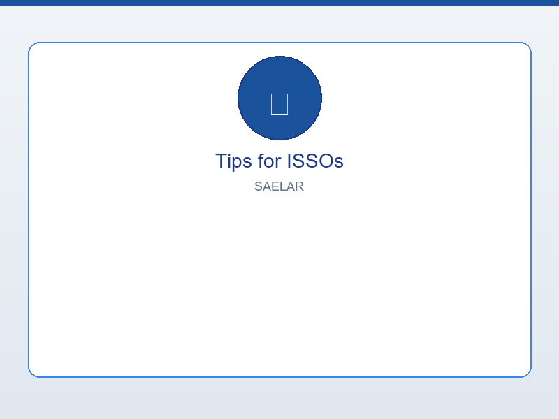
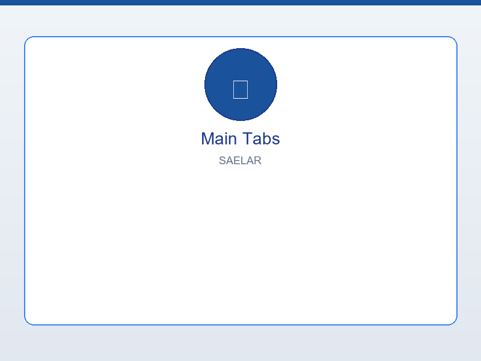
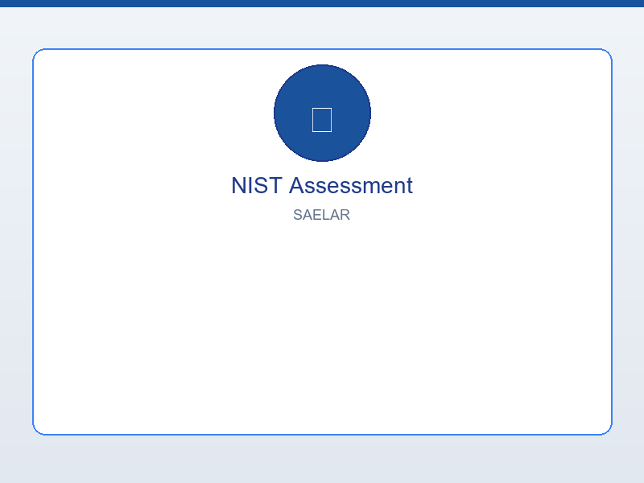
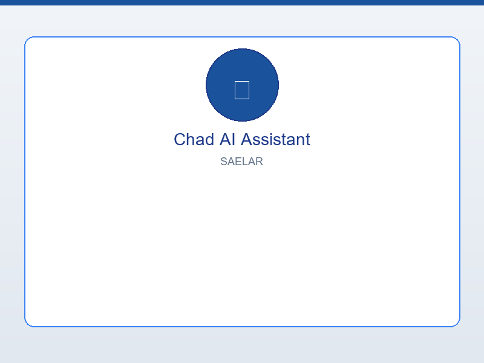
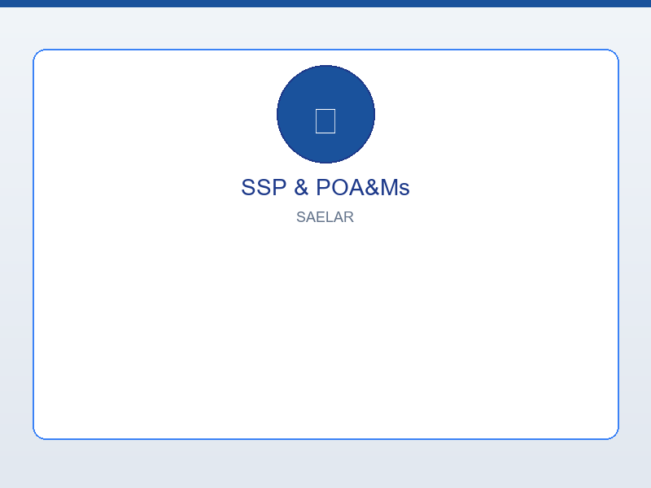
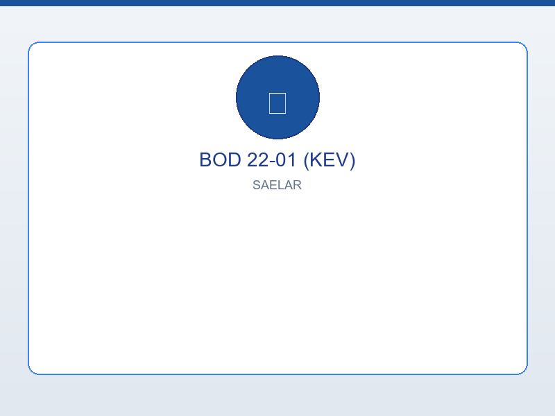

# SAELAR User Navigation SOP

## Standard Operating Procedure for Navigating the SAELAR Platform

**Document Version:** 1.0  
**Last Updated:** February 22, 2026  
**Audience:** ISSOs, Security Assessors, System Owners  
**Classification:** Internal Use

---

## Adding Screenshots

Place PNG screenshots in `user_manuals/screenshots/saelar/` with these filenames. They will appear throughout this SOP. *(Same files as the User Manual—see `user_manuals/screenshots/SAELAR_SCREENSHOTS_GUIDE.md`.)*

| Filename | What to Capture |
|----------|-----------------|
| `01_what_is.png` | Splash screen with logo, or main dashboard after login |
| `02_getting_started.png` | Sidebar with System info + control family selector |
| `03_main_tabs.png` | Tab bar: NIST Assessment, AWS Console, Chad, Risk, SSP, BOD 22-01 |
| `04_nist_assessment.png` | NIST Assessment tab – control families selected, sample results |
| `05_chad.png` | Chad (AI) tab – chat interface with sample Q&A |
| `06_ssp_poam.png` | SSP Generator tab – Generate SSP and/or POA&Ms sub-tab |
| `07_bod_kev.png` | BOD 22-01 tab – Check CVEs or KEV Dashboard |
| `08_tips.png` | Sidebar with system info populated, or overview |

**Quick capture:** Open SAELAR (e.g. https://saelar.ngrok.dev) → navigate to the screen → **Windows + Shift + S** → save as PNG with the exact filename.

---

## 1. Purpose & Scope

This SOP provides step-by-step guidance for navigating **SAELAR** (Security Assessment Engine for Live AWS Resources), an automated NIST 800-53 Rev 5 security assessment platform for live AWS environments. Use this document to:

- Understand the platform layout and where to find key features
- Complete common workflows (run assessments, generate SSPs, check KEVs)
- Access AWS configuration, control families, AI assistance, and reports

---

## 2. Prerequisites

Before using SAELAR, ensure:

| Requirement | Description |
|-------------|-------------|
| **Access** | Valid credentials (if authentication is enabled) |
| **AWS** | AWS credentials configured with permissions for CloudTrail, IAM, S3, Config, Security Hub, GuardDuty, etc. |
| **Browser** | Modern browser (Chrome, Firefox, Edge); recommended width 1280px+ |
| **URL** | SAELAR URL (e.g., `https://saelar.ngrok.dev` or your deployment URL) |

---

## 3. Platform Layout Overview

SAELAR uses a **sidebar + tabbed main content** layout:

  
*Figure 1: Main dashboard after login*

```
┌─────────────────────────────────────────────────────────────────────────────┐
│  SIDEBAR (left)                    │  MAIN CONTENT (right)                  │
│  • System Info                     │  Tab bar: NIST | AWS | Chad | Risk |    │
│  • AWS Account                     │  SSP | BOD 22-01 | Threat | Artifacts   │
│  • Assessment Config              │                                         │
│  • Control Families               │  Selected tab content                   │
│  • Run Assessment                 │                                         │
│  • Chad (AI) chat                 │                                         │
│  • Saved Results & Export         │                                         │
└─────────────────────────────────────────────────────────────────────────────┘
```

---

## 4. Sidebar Navigation (Top to Bottom)

  
*Figure 2: Sidebar with System info and Control Families*

### 4.1 🏢 System

  
*Figure 3: System section with details populated*

- **Purpose:** Store system details (name, acronym, owner, ISSO, AO, categorization) used for SSP generation and reports.
- **Action:** Click **"Enter System Details"** or **"Edit System Info"**.
- **Required fields:** System Name, Owner, Description (for SSP).
- **Tip:** Complete this **before** generating an SSP or Risk Acceptance Report (RAR).

---

### 4.2 ☁️ AWS Account

- **Purpose:** Displays connected AWS Account ID, IAM user, and region.
- **Action:** Use **"Change Account"** to re-authenticate or switch AWS credentials.
- **Note:** If not configured, you will be prompted to enter credentials (access key, secret key, region). Credentials can also be set via environment variables or EC2 instance profile.

---

### 4.3 ⚙️ Assessment Configuration

- **AWS Region:** Select the region to assess (e.g., `us-east-1`, `eu-west-1`, or **Default**).
- **Impact Level:** Choose FIPS 199 categorization: **Low**, **Moderate**, or **High**.
- **Note:** Changing impact level updates the number of controls available per family.

---

### 4.4 📋 Control Families

- **Purpose:** Select which NIST 800-53 Rev 5 control families to assess.
- **Actions:**
  - **Select All** – Select all families for the current impact level.
  - **Clear All** – Deselect all families.
  - **Individual checkboxes** – Select specific families (e.g., AC, AU, SC).
- **Links:** Use the 🔗 next to each family to open the NIST 800-53 catalog.
- **Selection Summary:** Shows number of families and total controls selected.

---

### 4.5 Security Hub Integration

- **"🔗 Security Hub Findings"** – View Security Hub findings only (no full assessment).
- **"Include in Assessment"** – Check to import Security Hub findings into the assessment (GuardDuty, Inspector, Macie, etc.).

---

### 4.6 🚀 Run Assessment

- **Purpose:** Start the NIST 800-53 assessment against live AWS resources.
- **Button:** **"Run Assessment (X controls)"** – Enabled when at least one family is selected.
- **Result:** Assessment runs, results display in the **NIST Assessment** tab; results are auto-saved to S3 and feed into the Risk Calculator.

---

### 4.7 📊 Control Counts

- **Purpose:** Reference table showing control counts per family for the selected impact level.
- **Use:** Verify how many controls you will assess before running.

---

### 4.8 💬 Chad (AI)

- **Purpose:** Inline chat with Chad (AI) for quick questions about findings, remediation, or compliance.
- **Action:** Type in the chat box or use quick-prompt buttons.
- **Note:** Chad uses AWS Bedrock (or local Ollama in air-gapped mode). Context is pulled from the current assessment results.

---

### 4.9 📁 SAVED RESULTS & EXPORT

- **Purpose:** Access saved assessment results, S3 export location, and downloaded reports (SSP, POA&M, RAR).
- **Use:** Check S3 paths, download buttons, and export status.

---

## 5. Main Content Tabs

  
*Figure 4: Main tab bar*

### 5.1 🛡️ NIST Assessment

  
*Figure 5: NIST Assessment tab with results*

- **Purpose:** Primary results view for NIST 800-53 assessments.
- **Contains:** Dashboard, findings, risk matrix, report, and NIST 800-30 enhanced analysis.
- **Typical flow:** Run assessment from sidebar → view results here.

---

### 5.2 ☁️ AWS Console

- **Purpose:** Quick links to AWS Console pages (IAM, CloudTrail, S3, Security Hub, etc.).
- **Use:** Jump to AWS services for manual verification or remediation.

---

### 5.3 🤖 Chad (AI)

  
*Figure 6: Chad (AI) chat interface*

- **Purpose:** Full Chad (AI) chat interface with preset questions and report generation.
- **Actions:** Use buttons (e.g., “Explain this finding”) or type custom questions. Chad can generate executive summaries, remediation plans, and other reports.

---

### 5.4 📊 Risk Calculator

- **Purpose:** Risk scoring and analysis for findings.
- **Auto-populated:** Import NIST assessment findings automatically.
- **Sub-tabs:** Dashboard, Findings, Risk Matrix, Report, NIST 800-30 (Threat Sources, ALE, Impact, MITRE ATT&CK, Enhanced Metrics).

---

### 5.5 📋 SSP Generator

  
*Figure 7: SSP Generator tab*

- **Purpose:** Generate System Security Plan (SSP), POA&Ms, and Risk Acceptance documents.
- **Prerequisites:** System info in sidebar; NIST assessment run.
- **Sub-tabs:**
  - **Generate SSP** – Create SSP Word document.
  - **POA&Ms** – Generate and export POA&M entries.
  - **Risk Acceptance** – Create RAR documents; use **Chad AI Draft** for justifications.

---

### 5.6 🚨 BOD 22-01

  
*Figure 8: BOD 22-01 CVE check*

- **Purpose:** CISA BOD 22-01 Known Exploited Vulnerabilities (KEV) integration.
- **Sub-tabs:** Dashboard, Check CVEs, Full Catalog, Report.
- **Use:** Check CVEs against the KEV catalog and generate compliance reports.

---

### 5.7 🎯 Threat Modeling

- **Purpose:** Threat modeling and adversary mapping.
- **Use:** Map controls to threats and techniques.

---

### 5.8 📁 Artifacts

- **Purpose:** Documentation and artifact management.
- **Use:** Access saved reports and generated documents.

---

## 6. Typical Workflows

### 6.1 First-Time Assessment

1. Log in (if auth enabled).
2. Configure AWS credentials (sidebar → AWS Account).
3. Enter **System** details (sidebar → System).
4. Select **Impact Level** (sidebar → Assessment Configuration).
5. Select **Control Families** (use **Select All** or individual checkboxes).
6. Optionally check **Include in Assessment** for Security Hub.
7. Click **Run Assessment**.
8. View results in **NIST Assessment** tab.
9. Use **Chad (AI)** for remediation guidance on specific findings.

---

### 6.2 Generate SSP

1. Ensure **System** info is complete.
2. Run at least one **NIST Assessment**.
3. Go to **SSP Generator** tab.
4. Use **Generate SSP** sub-tab.
5. Configure options (Include POA&M, Risk, Evidence, Recommendations).
6. Click **Generate System Security Plan**.
7. Download or open the generated Word document from **SAVED RESULTS & EXPORT**.

---

### 6.3 Check CVE Against BOD 22-01 KEV

1. Go to **BOD 22-01** tab.
2. Use **Check CVEs** sub-tab.
3. Enter CVE ID(s) and run the check.
4. Use **Full Catalog** or **Report** for broader analysis.

---

### 6.4 Create Risk Acceptance (RAR)

1. Run NIST Assessment.
2. Go to **SSP Generator** → **Risk Acceptance** sub-tab.
3. Select a finding.
4. Click **Chad AI Draft** to auto-fill justification and compensating controls.
5. Review, edit, and generate the RAR document.

---

## 7. Tips for ISSOs

| Tip | Description |
|-----|-------------|
| **Control Families** | Start with AU, AC, SC, IA for core infrastructure; add others as needed. |
| **Security Hub** | Enable “Include in Assessment” to enrich results with GuardDuty, Inspector, and other sources. |
| **Chad (AI)** | Use for remediation suggestions, executive summaries, and draft text for POA&Ms. |
| **System Info** | Complete System details early; they flow into SSP, POA&M, and RAR. |
| **S3 Auto-Save** | Results are saved to S3 automatically; check **SAVED RESULTS** for paths. |

---

## 8. Troubleshooting

| Issue | Action |
|-------|--------|
| **“AWS credentials not found”** | Re-enter credentials via sidebar or configure environment variables. |
| **“No system configured”** | Enter system details in sidebar → System. |
| **“Please select at least one family”** | Select at least one control family before running assessment. |
| **Chad (AI) not responding** | Verify AWS Bedrock access; in air-gapped mode, ensure Ollama is running. |
| **SSP generation fails** | Ensure System Name, Owner, and Description are filled; run NIST Assessment first. |

---

## 9. Related Documentation

- **SAELAR_SOPRA_Consolidated_Briefing.md** – Platform overview and data sources
- **SAELAR_SOPRA_AWS_Test_Environment_Provisioning_Guide.md** – Deployment and provisioning
- **user_manuals/screenshots/SAELAR_SCREENSHOTS_GUIDE.md** – Screenshot locations for user manual

---

*End of SOP*
