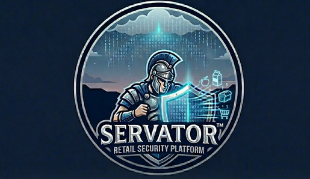

# Servator



**AI-Driven Retail Security Platform**

Commercial security solution for grocery and retail franchises. Reduces product theft through computer vision, behavioral analytics, and predictive intelligence—cost-conscious and scalable.

---

## The Problem

- **$1M+ annual losses** to product theft (typical mid-size grocery franchise)
- External theft (shoplifting, SCO abuse)
- Internal theft (employee fraud patterns)
- Limited visibility into where, when, and how loss occurs

## The Solution

Servator combines:

| Module | Purpose | Cost Profile |
|--------|---------|--------------|
| **SCO Vision** | Self-checkout anomaly detection | Reuse existing cameras |
| **Shelf Monitor** | High-shrink category surveillance | Edge-first, targeted |
| **Predictive Analytics** | Risk scoring by SKU, aisle, time | Data you already have |
| **Command Center** | Unified dashboards, alerts, incident management | SaaS or on-prem |

---

## Quick Start

```bash
# Install
cd servator
pip install -r requirements.txt

# Run demo (local)
python -m servator.app

# Or with Streamlit
streamlit run servator/app/dashboard.py
```

---

## Architecture

```
servator/
├── app/           # Web dashboard & API
├── core/          # Core logic, models, analytics
├── vision/        # AI/ML models (SCO, shelf)
├── analytics/     # Predictive shrink, risk scoring
├── config/        # Store config, deployment
└── docs/          # Commercial docs, deployment
```

---

## Target: Grocery Retail Franchises

- **Safeway** (Albertsons Companies)
- Regional chains
- Convenience stores with high-shrink categories

---

## License

Proprietary - Commercial use.
